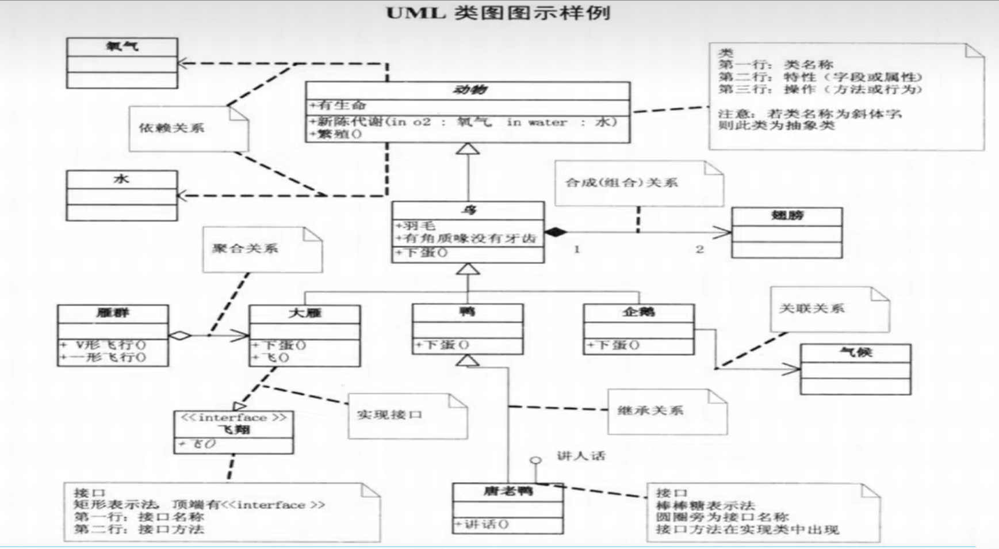

#markdown+vscode
##基础教程
###1.标题
```
语法:
  #
示例:
   # 一级标题
   ## 二级标题
   ### 三级标题
   #### 四级标题
   ##### 五级标题
   ###### 六级标题
```

###2.强调
eg: **强调**
```
语法:**content**
示例:
   **强调**
```

###3.斜体
eg: *斜体*
```
语法: *content*
示例:
*斜体*
```

###4.删除线
eg:~~删除线~~
```
语法:~~content~~
示例:
~~删除线~~
```

###5. 高亮
eg: ==高亮==
```
语法:==content==
示例:
==高亮==
```

###6.代码
eg: `code`
`
**语法:** ``
**示例:**
```
   ` function fn(){} `
```
###7.代码块
eg:  
```js 
   function Fn(){
      console.log('hello world');
   }
```
```
    ```js
      function Fn(){ console.log('hello world')};
    ```
```

###8.引用
eg: 
> 1级
>> 2级
3级
```
 > 1级
 >> 2级
```

###9. 无序列表
eg:
 - 苹果
 - 西瓜
 - 葡萄
```
   - 苹果
   - 西瓜
   - 葡萄
```

###10. 有序列表
eg:
1. 明天早起
2. 明天锻炼
3. 明天学习
```
   1. 明天早起
   2. 明天锻炼
   3. 明天学习
```

###11. 上标(扩展语法)
eg:
   2^3^
```
   2^3^
```

###12. 下标(扩展语法)
eg:
  H~2~O
```
   H~2~O
```

###13. 脚注(扩展语法)
eg: 
学习markdown[^1]语法

[^1]: Markdown 是一种轻量级标记语言

```
   学习markdown[^1]语法

   [^1]: Markdown 是一种轻量级标记语言
```


###14. 链接
eg:
[百度](https://www.baidu.com)
[跳转](###6.代码)
```
  [百度](https://www.baidu.com)
  [跳转](###6.代码)
```

###15.任务列表
todolist:
- [ ] 刷b站
- [ ] 写代码
- [x] 起床
```
- [ ] 刷b站
- [ ] 写代码
- [x] 起床
```


###16.表格
| 学 号|姓 名|年 龄|
| :--- | :----: | ----: |
| 1001|张三|20|
| 1002 | 李四|19|
```
| 学号|姓名|年龄|
|:--|:--:|--:|
| 1001|张三|20|
| 1002 | 李四|19|
```

###17.图片

```

```

###18.分割线
---
```
 ---
```

###19.emoji
:sweat_smile:
:drooling_face:
:clown_face:
[emoji全网站](https://emojipedia.org/)
```
:sweat_smile:
```