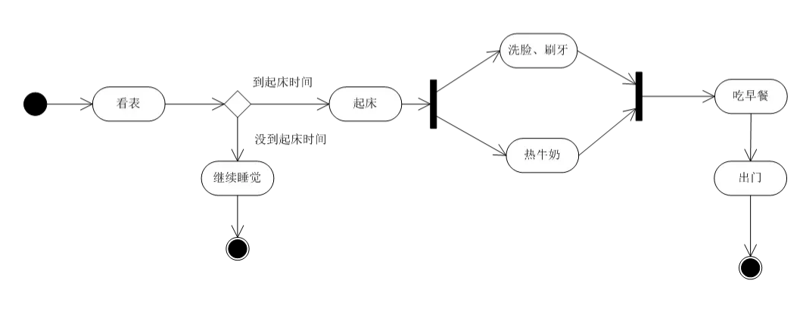

#结构型  -静态
类图、对象图、构件图、部署图、包图
# 行为型 -动态
活动图、状态图、顺序图、通信图、用例图、时序图


### 活动图
一个活动到另一个活动的控制流，描述活动的顺序（活动表示处理事物的动作和状态）
活动描述：
小张每天醒来后先看表是否到起床时间，如果没到继续睡觉；如果到了，抓紧时间起床，洗漱完毕后吃早餐，饭后出门。


### 构件图（组件图）
展现了一组构建之间的组织和依赖

### 部署图
物理方面建模

### 用例图
(1) 用例图
(2) 参与者
(3) 关系


#### 关系
**扩展关系** *（某种情况）*
```js
借书 ---  超时扣押金
```

**包含关系** *（前置条件）*
```js
访问我的订单信息 --- 登录
```

**泛化关系** *（更具体的描述）*

参与者与参与者之间可以泛化
用例与用例之间也可以泛化
```js
学生 ---  留学生
登录  ---- 手机号登录/微信登录/支付宝登录
```

#