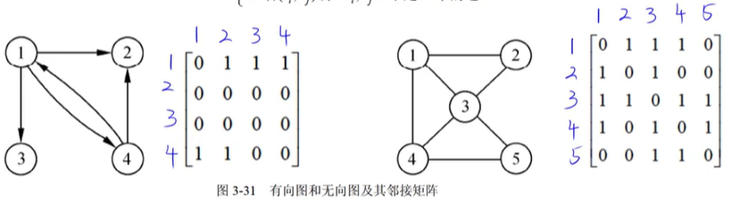
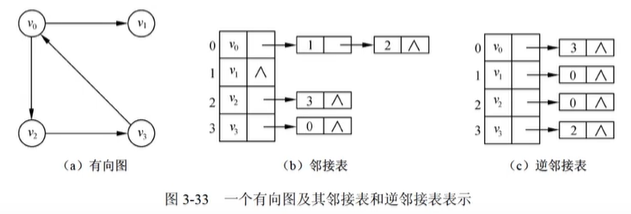
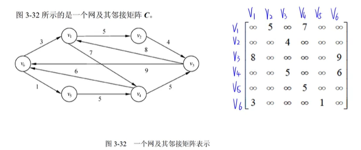

# 图

图G是由集合V和E构成的二元组，记作G=(V,E),其中V是顶点的非空有限集合，
E是边的有限集合。

* **有向图**

* **无向图**

## 完全图
若一个无向图具有n个顶点，每个顶点 与其他n-1个顶点之间都有边，则称为无向完全图，$边数= \frac{n(n-1)}{2}$

n个顶点的有向完全图，$边数= n(n-1)$

* **顶点度**
顶点v关联的边数目D(v)

* **出度**
从顶点v指出去的边数目OD(v)

* **入度**
  指向顶点v的边数目ID(v)

* **关系**
顶点n,边数e, 度D
$$ e = \frac{1}{2}\sum^n_{i=1}D(v_i)$$
$$  总度数 = 2e $$

* **路径**
路径长度 = 路径上边的数目

* **环/回路**
第一个顶点和最后一个顶点相同

* **简单路径**
除了头尾结点相同，中间结点不同

* **连通图（无向图）**
任意两个顶点都是有路径，没有孤立点，最少n-1条边可构成连通图；最多n(n-1)/2

* **强连通图（有向图）** 
任意两个顶点都是有路径，最少条边， 最多n(n-1)

## 图存储
* **邻接矩阵法**

* **邻接链表法**

* **稠密图**
邻接矩阵
* **稀疏图**
邻接链表

## 网
边带权值就是网

## 图遍历
从某个顶点出发，沿着某条路径对图所有顶点进行访问且只访问一次。
深度优先 DFS
广度优先 BFS

时间复杂度跟存储结构有关
$邻接矩阵 O(n^2)$ 栈
$邻接链表O(n+e)$   队列

## 拓扑排序 
* **AOV网**
在工程领域，一个大的工程项目通常被划分为许多较小的工程(称为活动)，这些子工程都完成，整个工程也就完成
在有向图中，以顶点表示活动，用有向边表示活动之间优先关系，这样的有向图称为活动网（Activity On Vertex network）  
AOV网不应该有环

* **拓扑序列**
选入度为0的顶点，输出后删除该顶点和边，重复执行

$顶点v_i在v_j之前，可能存在<v_i,v_j>弧,一定不存在<v_j,v_i>的弧$