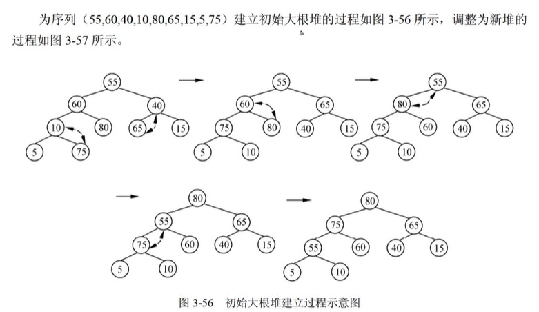

## 查找
* **顺序查找**
  
* **折半查找**
$$最多查找次数 = \lfloor\log_2^n\rfloor+1$$
```js
    let key = num1;
    function find(left,right){
        if(left<=right){
            mid = math.floor(left+(right-left)/2);
            if(arr[mid]>=key){
               return find(left, mid-1)
            }
               return find(mid+1,right)
        }
        return -1;    
    }
    
```

## 哈希表


## 堆
$$n个关键码构成的序列\{k_1,k_2,k_3,...k_n\},当且仅当满足下列关系时称其为堆 $$
$$小顶堆\begin{cases}
    k_i\leq k_{2i}\\
k_i\leq k_{2i+1}
\end{cases}
$$
$$15,25,21,33,73,65,53$$
$$
大顶堆\begin{cases}
    k_i\geq k_{2i}\\
    k_i\geq k_{2i+1}
    \end{cases}
$$
$$73,65,25,33,53,15,21$$
***大顶堆构建过程**

## 排序