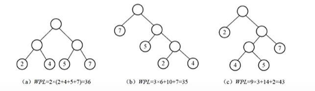

#树
* **定义**
  
* **性质**
1. $ 树的结点总数 = 度总数 + 1 $
2. $ 度为m的树，第 i 层 至多有 m^{i-1}个结点 (i>=1)$
3. $ 度为m的树，深度为h，至多有 \frac{m^h-1}{m-1} 结点 $
4. $ 具有n个结点，度为m，则树高度 h = \log_{m}{n(m-1)+1} $
 $ h_{min} = \lceil\log_{m}{n(m-1)+1}\rceil $

##2.1二叉树概念
* **定义**
    左子树，右子树组成，$度max=2$

* **性质**
1. $ 第i层最大节点数 = 2^{i-1} $
2. $ 树高h最大节点数 = 2^h-1 $
3. $ 度为0的节点数为 n_0，度为2的节点数为 n_2 , 则有  n_0 = n_2 +1 $
4. $ 具有n个结点的完全二叉树的高度为 \lfloor\log_{2}{n}\rfloor+1 或 \lceil\log_{2}{(n+1)}\rceil$

* 二叉树的形态
$ 卡特兰数 = \frac{C_{2n}^{n}}{n+1} $
$  C^{m}_{n}=\frac{n!}{m!*(n-m)!} $

### 满二叉树
* **定义**
  $ 深度为k的二叉树有 2^k-1 个结点，就叫做满二叉树 $

* **性质**
1. $ 第i层节点数 = 2^{i-1} $
2. $ 树高h,  总节点数 = 2^h-1, 叶子节点数 = 2^{h-1} $

### 完全二叉树
* **定义**
  除第h层(即最后一层)，其余层都是满的，第h层结点从左到右依次放置，不能留空，就叫做完全二叉树

* **性质** 

## 2.2 二叉树存储
### 顺序存储
完全二叉树适合顺序存储，其他会比较浪费空间
### 链式存储
* **二叉链表**
left 左指针
right 右指针
 n+1个空指针
* **三叉链表**
left 左指针
right 右指针
parent 父指针
n+2个空指针

## 2.3二叉树遍历
### 前序
根左右
Q1:根据二叉树图写出前序列
### 中序
左根右
Q2:根据二叉树图写出中序列
### 后序
左右根
Q3:根据二叉树图写出后序列
### 构造二叉树
**前序+中序**
中序判左右，前序来判根
Q4:根据中前构建二叉树
**后序+中序**
中序判左右，后序来判根
Q5:根据中后构建二叉树
**层序+中序**
中序判左右，层序来判根
Q6:根据中层构建二叉树
## 2.4 平衡二叉树

## 2.5 二叉查找树
关键字序列
## 2.6 最优二叉树（哈夫曼树）
* **路径**
从树得一个结点到另一个结点之间的通路，路径上的分支数目称为路径长度。
* **树的路径长度**
从树根到每个叶子之间路径长度之和
* **带权路径长度**
$$ WPL=\sum_{k=1}^nw_kl_k $$
$n 为带权叶子结点数目，w_k 为叶子结点权值，l_k为叶子结点到根的路径长度$

* **构造哈夫曼树**
1. $ 给定n个权值{w_1,w_2,...w_n},构成n棵树的集合F={T_1,T_2,...T_n},其中，每棵树T_i中只有一个带权为w_i的根节点，其左右子树均空 $
2. $在F中选取两个权值最小的树作为左右子树构造一棵新的二叉树，置新构造二叉树的根节点的权值为其左右子树根节点的权值之和$
3. $从F中删除这两棵树，同时将新得到的二叉树加入F中$
4. $重复2，3步，直到F中只含一棵树时为止，这棵树便是最优二叉树$

## 2.7 哈夫曼树
带权路径长度最短的树
* **性质：**
1. $ 哈夫曼树只有度为0，2的结点 $
2. $ n个权值的哈夫曼树，结点数 = 2n-1 $

* **根据哈夫曼树计算哈夫曼编码**
$n个权值{w_1,w_2,...,w_n}, 频率{p_{w1},p_{w2},...p_{wn}},$
* **根据哈夫曼编码推权值序列**
${n个权值}$
* **等长编码至少需要多少位**
$n个权值，2^x \geq n ,  x \geq \log_2^n$

* **等长编码长度**

|字符w| $w_1$ | $w_2$ | $w_3$ |...|$w_m$|
|---|---|----|---|---|---|
|频率p| $n_1$ |$n_2$ |$n_3$|...|$n_m$|

$$ 字长= \lceil\log2^m \rceil $$
$$ 等长编码长度 = 字长 * \sum_{i=1}^m p $$

* **构建哈夫曼树**（考点）

* **求压缩率**
  $$ 压缩率=\frac{等长编码长度-哈夫曼编码长度}{等长编码长度}$$
## 2.8 线索二叉树